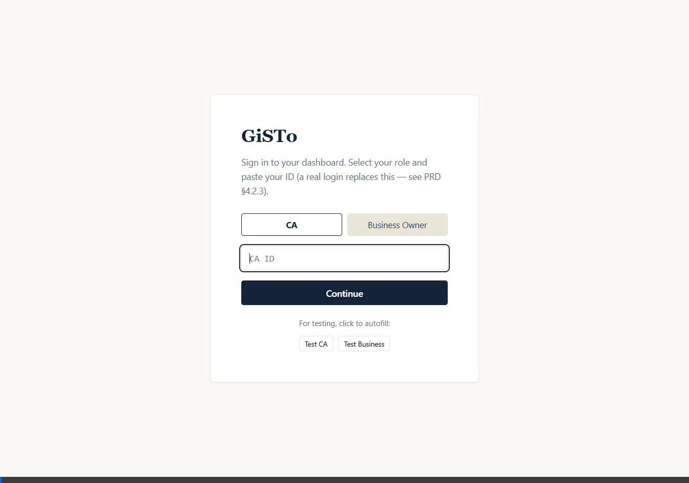
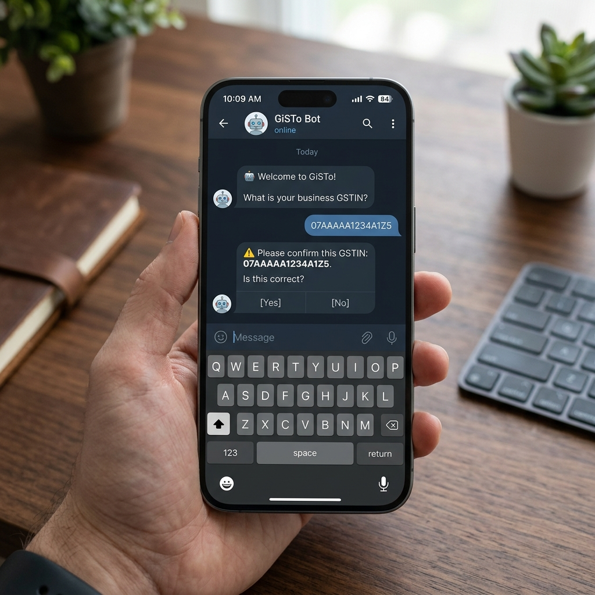

<p align="center">
  
</p>

<h1 align="center">GiSTo 🧾</h1>

<p align="center">
  <a href="docs/ARCHITECTURE.md">System Architecture</a> |
  <a href="docs/DATA_MODEL.md">Data Model</a> |
  <a href="https://gisto.vercel.app">Live CA Dashboard</a>
</p>

<p align="center">
  
  
  
  
</p>

<h3 align="center">
  <em>Never lose tax credit to a supplier who didn't file.</em>
</h3>


This is a runnable implementation of the GiSTo PRD: a Telegram bot
(Phase 1), a CA web dashboard (Phase 2), the Phase 3 risk-scoring layer,
and a Phase 4 WhatsApp decoupling proof. It's built to run end-to-end on
a laptop with **zero real credentials** — no GST Suvidha Provider (GSP)
account, no LLM API key, no live Telegram bot token required to see the
whole product work.

## System Overview

Below is a glimpse of how GiSTo works in action:

### CA Dashboard


### Telegram Bot


## Documentation

We have comprehensive documentation in the `docs/` folder:
- [System Architecture & Workflows](docs/ARCHITECTURE.md)
- [Data Model & ERD](docs/DATA_MODEL.md)
- [Contributing Guidelines](CONTRIBUTING.md)
- [Code of Conduct](CODE_OF_CONDUCT.md)

## What's real vs. mocked

| Piece | Status |
|---|---|
| Data model (§6) | Real — full SQLAlchemy schema, Alembic migration included |
| ITC matching / alert logic (§3.3) | Real business logic, runs against a mock GSP |
| CA dashboard (§4) | Real React app, real API calls, no mock data baked into the frontend |
| Risk scoring (§8.3) | Real, computed from filing_history |
| GST Suvidha Provider | **Mocked** — deterministic fake responses (see `backend/app/gsp/mock_gsp.py`). Swap in WhiteBooks/GSTHero once a vendor is selected (§5.3/§7.2 open item) |
| Invoice extraction | **Mocked** — returns canned structured data, no LLM call. See `backend/app/extraction/README.md` for the exact steps to wire in Mistral |
| Telegram bot | Real bot code (python-telegram-bot), needs a real `TELEGRAM_BOT_TOKEN` from @BotFather to actually run against Telegram's servers |
| WhatsApp (Phase 4) | Stub provider proving the messaging layer is decoupled from core logic (§5.2) — not a real WhatsApp Business API integration (needs a registered business + provider account) |

## Repo layout

```
gisto/
├── backend/        FastAPI + PostgreSQL — the shared API for bot & dashboard
│   ├── app/
│   │   ├── models/        Business, CA, BusinessCALink, Supplier, Invoice, Alert, GSTSyncLog (§6)
│   │   ├── gsp/            GSP adapter interface + mock (§5.3)
│   │   ├── extraction/     Invoice extraction adapter interface + mock (§3.2) + README for adding Mistral
│   │   ├── services/        Onboarding, invoice, GST sync/ITC matching, alerts, CA, risk scoring
│   │   ├── routers/         REST endpoints
│   │   └── scheduler.py     Periodic sync / risk-score recompute jobs
│   ├── alembic/             DB migrations
│   ├── scripts/seed.py      Realistic demo data (Nagpur electronics shop, "Ravi Trading" example from the PRD)
│   └── tests/smoke_test.py  End-to-end test of the core loop
├── bot/             Telegram bot (Phase 1, §3)
│   └── app/handlers/        onboarding.py, invoice.py, alerts.py, digest.py — one file per PRD flow
├── dashboard/       React CA dashboard (Phase 2, §4)
│   └── src/pages/           PortfolioPage.jsx (§4.2.1), BusinessDetailPage.jsx (§4.2.2)
├── docs/            Architecture diagrams, data models, and assets
├── whatsapp/        Phase 4 decoupling proof (§8.4, exploratory)
└── docker-compose.yml
```

## Running it

### Option A — Docker Compose (closest to production shape)

```bash
cp backend/.env.example backend/.env
cp bot/.env.example bot/.env
# Add a real TELEGRAM_BOT_TOKEN to bot/.env if you want the bot to actually
# connect to Telegram. Leave GSP_PROVIDER=mock and EXTRACTION_PROVIDER=mock
# (the defaults) to run with zero other credentials.

docker compose up --build
```

This brings up Postgres, runs migrations, seeds demo data, starts the
backend on `:8000`, the bot (if a token is set), and the dashboard on
`:5173`.

### Option B — Run pieces individually (what was used to build/test this)

```bash
# Backend, against SQLite for zero setup (swap DATABASE_URL for Postgres
# in production — see backend/.env.example)
cd backend
pip install -r requirements.txt
export DATABASE_URL="sqlite:///./gisto.db"
python -c "from app.core.db import Base, engine; from app import models; Base.metadata.create_all(engine)"
python -m scripts.seed
uvicorn app.main:app --reload

# Dashboard, in another terminal
cd dashboard
npm install
VITE_BACKEND_BASE_URL=http://localhost:8000 npm run dev
# open http://localhost:5173 and paste in the CA ID printed by scripts/seed.py

# Bot, in another terminal (needs a real token from @BotFather)
cd bot
pip install -r requirements.txt
export TELEGRAM_BOT_TOKEN="..."
export BACKEND_BASE_URL="http://localhost:8000"
python -m app.main
```

### End-to-end smoke test (no servers needed)

```bash
cd backend
pip install -r requirements.txt
python tests/smoke_test.py
```

Exercises onboarding → invoice submission → ITC risk alert → reminder
draft → digest → CA invite → portfolio view → risk scoring, all against
an in-memory SQLite DB.

## PRD section → implementation map

| PRD section | Where it lives |
|---|---|
| §3.1 Onboarding | `backend/app/services/onboarding_service.py`, `bot/app/handlers/onboarding.py` |
| §3.2 Invoice submission | `backend/app/services/invoice_service.py`, `bot/app/handlers/invoice.py` |
| §3.3 ITC Risk Alert | `backend/app/services/gst_sync.py`, `backend/app/services/alert_service.py`, `bot/app/handlers/alerts.py` |
| §3.4 Digest | `backend/app/services/alert_service.py::build_digest`, `bot/app/handlers/digest.py` |
| §3.5 CA invite | `backend/app/services/ca_service.py::create_invite`, `bot/app/handlers/onboarding.py` |
| §4.2.1 Portfolio view | `backend/app/services/ca_service.py::get_portfolio`, `dashboard/src/pages/PortfolioPage.jsx` |
| §4.2.2 Drill-down + export | `backend/app/routers/ca.py`, `backend/app/routers/export.py`, `dashboard/src/pages/BusinessDetailPage.jsx` |
| §4.2.3 Permissions | `backend/app/models/ca.py::BusinessCALink.permission` |
| §5.3 GSP | `backend/app/gsp/` |
| §6 Data model | `backend/app/models/` (1:1 with every entity/field listed) |
| §8.3 Risk scoring (Phase 3) | `backend/app/services/risk_scoring.py` |
| §8.4 WhatsApp (Phase 4) | `whatsapp/` |

## Known simplifications (MVP, documented rather than hidden)

- **No real auth.** The dashboard's "CA ID" entry screen stands in for
  the real login PRD §4.2.3 describes. A production build needs actual
  sessions/JWTs and a check that the logged-in CA matches the `ca_id`
  used in API calls — the current backend trusts whatever `ca_id` is
  passed in the URL.
- **CSV export only**, not also Excel (§4.2.2 names both) — trivial to
  add with `openpyxl` once needed.
- **Polling, not push**, for the bot's proactive notifier
  (`bot/app/services/notifier.py`) — fine at MVP scale, would move to a
  backend-side event/queue once volume justifies it.
- **Reminder "sending" is mocked** — there's no real SMS/email/WhatsApp
  channel to the *supplier* wired up, since the PRD doesn't specify one;
  `confirm_reminder_sent` just flips the alert's status.
