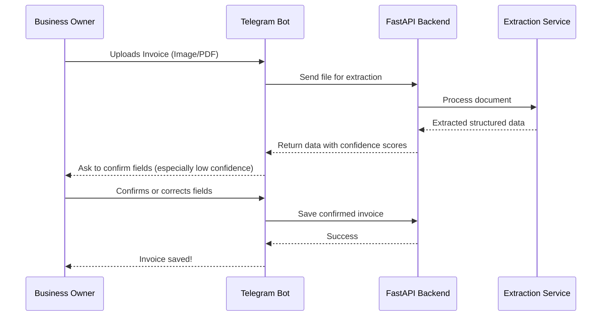
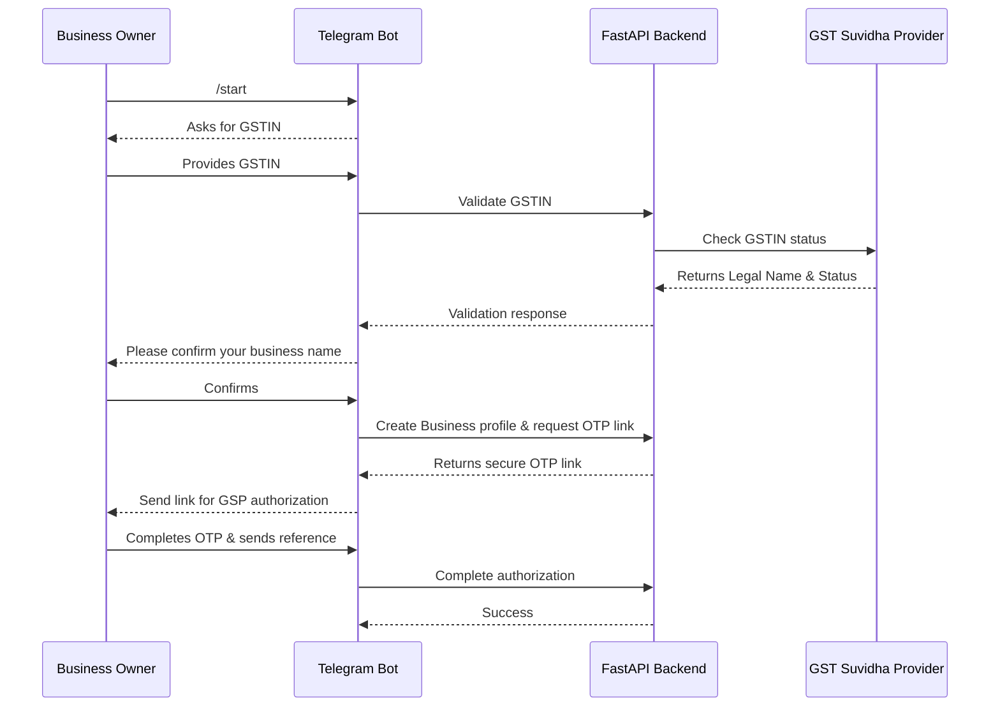

# GiSTo Architecture

GiSTo is built as a set of decoupled services that communicate through a shared backend API. It consists of a Telegram bot (for the business owner), a React dashboard (for the CA), and a FastAPI backend (to tie everything together with the PostgreSQL database).

## High-Level System Architecture

```mermaid
graph TD
    %% Components
    Owner([Business Owner])
    CA([Chartered Accountant])
    
    Bot[Telegram Bot\n(python-telegram-bot)]
    Dashboard[CA Dashboard\n(React/Vite)]
    
    Backend[FastAPI Backend\n(Core Logic)]
    DB[(PostgreSQL)]
    
    MockGSP[[Mock GSP API]]
    MockExtraction[[Mock LLM Extractor]]
    
    %% Relationships
    Owner -->|Sends Invoices| Bot
    Bot -->|REST API| Backend
    
    CA -->|Views Portfolio| Dashboard
    Dashboard -->|REST API| Backend
    
    Backend <-->|SQLAlchemy| DB
    Backend -->|Validate & Sync| MockGSP
    Backend -->|Extract Data| MockExtraction
```

## Workflows

### 1. Invoice Submission Flow


### 2. Onboarding & GST Sync Flow

