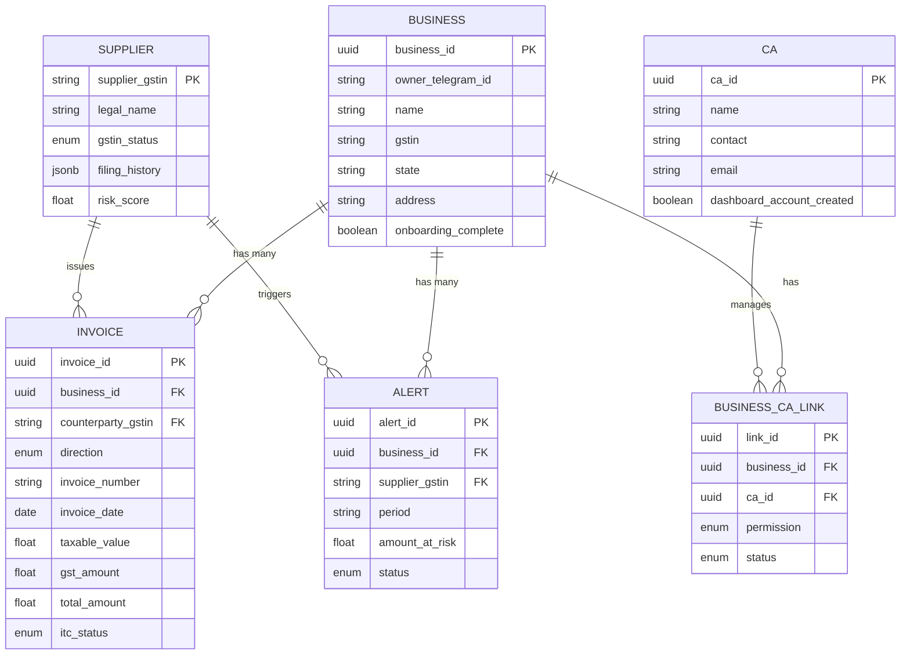

# GiSTo Data Model

This document outlines the core database schema used by GiSTo. The backend utilizes PostgreSQL and SQLAlchemy.

## Entity-Relationship Diagram (ERD)

```mermaid
erDiagram
    BUSINESS ||--o{ INVOICE : "has many"
    BUSINESS ||--o{ ALERT : "has many"
    BUSINESS ||--o{ BUSINESS_CA_LINK : "has"
    
    CA ||--o{ BUSINESS_CA_LINK : "manages"
    
    SUPPLIER ||--o{ INVOICE : "issues"
    SUPPLIER ||--o{ ALERT : "triggers"

    BUSINESS {
        uuid business_id PK
        string owner_telegram_id
        string name
        string gstin
        string state
        string address
        boolean onboarding_complete
    }

    CA {
        uuid ca_id PK
        string name
        string contact
        string email
        boolean dashboard_account_created
    }

    BUSINESS_CA_LINK {
        uuid link_id PK
        uuid business_id FK
        uuid ca_id FK
        enum permission
        enum status
    }

    SUPPLIER {
        string supplier_gstin PK
        string legal_name
        enum gstin_status
        jsonb filing_history
        float risk_score
    }

    INVOICE {
        uuid invoice_id PK
        uuid business_id FK
        string counterparty_gstin FK
        enum direction
        string invoice_number
        date invoice_date
        float taxable_value
        float gst_amount
        float total_amount
        enum itc_status
    }

    ALERT {
        uuid alert_id PK
        uuid business_id FK
        string supplier_gstin FK
        string period
        float amount_at_risk
        enum status
    }
```
